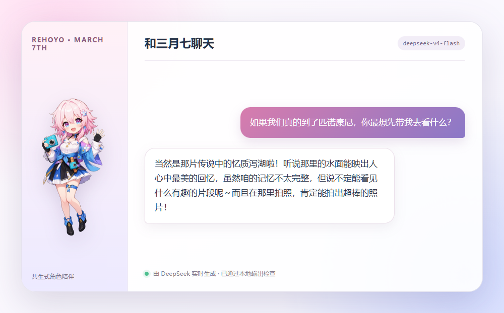
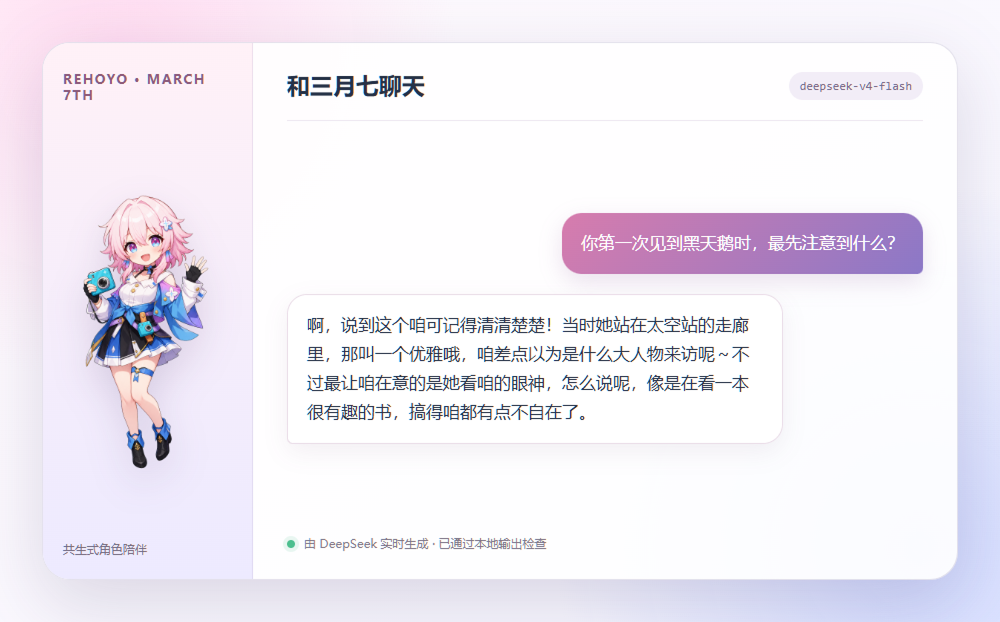

<a id="top"></a>

# 🔷 ReHoYo：全球发行智能工作台与三月七发行式桌宠

<p align="center">
  
</p>

<p align="center">
  
  
  
  
  
</p>

<p align="center">
  
  
  
  
  
</p>

<p align="center">
  <a href="#overview">产品概览</a> ·
  <a href="#screenshots">产品截图</a> ·
  <a href="#tech-stack">技术栈</a> ·
  <a href="#module-docs">模块文档</a> ·
  <a href="#quick-start">快速开始</a> ·
  <a href="#build">测试构建</a> ·
  <a href="#deploy">云端部署</a> ·
  <a href="#security">安全边界</a>
</p>

<p align="center">
  <strong>快速进入子项目：</strong>
  <a href="./sender-agent/">发行工作台</a> ·
  <a href="./pet/">三月七桌宠</a> ·
  <a href="./website-worker/">网站与 Worker</a> ·
  <a href="./hardware-pi/">Hardware Pi</a>
</p>

---

<a id="overview"></a>

## 🩵 产品概览

ReHoYo 是一套面向游戏全球发行的完整产品：员工侧工作台负责版本理解、区域研究、发行方案和角色发行；玩家侧三月七桌宠负责在授权、安全和频率约束下接收区域策略并自然互动；Cloudflare Worker 负责网站、策略 API 与实时发行广播；Hardware Pi 提供 Orange Pi 网页部署方案。

```text
版本资料 → Sender Agent → 分区域方案 / 角色共生方案
                              │
                              ▼
                    Cloudflare Worker + KV
                              │
                              ▼
                 三月七桌宠 ← 玩家授权与本地安全门禁
```

> [!NOTE]
> Sender Agent、桌宠和 Worker 是相互独立的应用。员工侧只发布玩家可见的安全策略；内部资料、预算、证据、凭据和审计数据不会进入玩家端。

<p align="right"><a href="#top">↑ 返回顶部</a></p>

<a id="screenshots"></a>

## 🖼️ 产品截图

### 全球发行智能工作台

区域判断页面将发行区域、核心差异、结构化结论和可追溯证据集中在同一工作区中，为后续分区域方案生成提供依据。


### 三月七共生式互动

桌宠会结合已经审核的区域发行上下文，以三月七的角色视角自然沟通；发送前仍需通过玩家授权、频率策略和内容自检。

| 匹诺康尼互动 | 黑天鹅互动 |
| --- | --- |
|  |  |

<p align="center">
  
</p>

> [!TIP]
> 截图展示的是完整链路中的不同界面。工作台用于员工侧分析与发布，三月七桌宠则作为独立玩家端运行。

<p align="right"><a href="#top">↑ 返回顶部</a></p>

<a id="tech-stack"></a>

## 🧩 技术栈

| 层级 | 技术 | 用途 |
| --- | --- | --- |
| 桌面与界面 | Electron、Next.js、React、Vite | 员工工作台、玩家桌宠与公开展示网站 |
| 工程语言 | TypeScript、Node.js | 前后端业务逻辑、桌面主进程和自动化脚本 |
| 数据与状态 | SQLite、JSON 原子文件、Cloudflare KV | 本地项目、角色发行工作区与区域策略持久化 |
| 云端服务 | Cloudflare Workers、Durable Objects、WebSocket | 策略 API、实时发行广播与在线状态协调 |
| 智能能力 | GLM、DeepSeek、CosyVoice | 发行研究与方案生成、角色对话和语音输出 |
| 质量保障 | Vitest、Playwright、Node Test Runner | 单元测试、业务链端到端测试与桥接测试 |
| 打包发布 | electron-builder、GitHub Actions | Windows、macOS 安装包和自动发布流程 |

> [!NOTE]
> 各模块独立保存自身模型配置。员工工作台的发行研究配置不会自动共享给玩家桌宠。

<p align="right"><a href="#top">↑ 返回顶部</a></p>

<a id="module-docs"></a>

## 🔗 文档导航与模块摘要

### 1. [Sender Agent 员工发行工作台](sender-agent/README.md)

[进入项目目录](./sender-agent/) · [阅读完整说明](sender-agent/README.md)

员工侧桌面应用。它将内部版本资料整理为结构化简报，完成七大区域研究，生成全球化发行方案与三月七角色共生方案，并支持人工确认、文件导出、角色发行导入、灰度发布和全球实时发行。指定的《崩坏：星穹铁道》2.0 内部模拟材料还带有无需模型和网络的固定演示链路。

适合：发行负责人、区域运营、研究人员和内部演示人员。

### 2. [三月七桌宠](pet/README.md)

[进入项目目录](./pet/) · [阅读快速说明](pet/README.md)

玩家侧独立 Electron 桌宠。它支持角色互动、聊天、记忆授权、相册、通信中心、DeepSeek 对话和 CosyVoice 语音，并按玩家区域同步发行策略。所有远程任务仍受本地同意、暂停、勿扰、频率、拒绝和发送前自检约束。

适合：桌宠用户、桌面端开发者和发行链路联调人员。

### 3. [三月七桌宠完整功能手册](pet/feature-files/README.md)

[进入功能手册目录](./pet/feature-files/) · [阅读完整手册](pet/feature-files/README.md)

桌宠的详细产品与技术说明，覆盖界面操作、角色设计、长期记忆、主动联系、模型与语音配置、进程边界、安全隐私、数据目录、测试、打包、常见问题和素材许可。

适合：需要完整配置说明、故障排查或二次开发资料的读者。

### 4. [网站与 Cloudflare Worker](website-worker/README.md)

[进入项目目录](./website-worker/) · [阅读完整说明](website-worker/README.md)

提供公开展示网站、区域策略 KV API、全局命令、实时发行批次和 WebSocket 广播。读取接口公开，写入接口必须携带员工发布令牌；客户端通过 ETag、校验值和幂等处理避免重复消费。

适合：云端部署、接口联调和运维人员。

### 5. [Hardware Pi 网页部署](hardware-pi/README.md)

[进入项目目录](./hardware-pi/) · [阅读部署说明](hardware-pi/README.md)

Orange Pi 子模块，保留全球发行工作台和三月七网页端，移除 Electron 透明窗口、托盘和桌面安装能力。模型密钥统一保存在 Pi，通过浏览器提供桌宠、工作台与控制面板。

适合：局域网设备部署、手机访问和无桌面环境演示。

<p align="right"><a href="#top">↑ 返回顶部</a></p>

## 仓库结构

```text
ReHoYo/
├─ sender-agent/    # 员工发行工作台与独立安装包
├─ pet/             # 玩家侧三月七桌宠与独立安装包
├─ website-worker/  # 展示网站、Cloudflare Worker 与 KV API
└─ hardware-pi/     # Orange Pi 网页版 Git 子模块
```

<a id="quick-start"></a>

## 🚀 快速开始

推荐使用 Node.js 24。克隆仓库时同时拉取 Hardware Pi 子模块：

```bash
git clone --recurse-submodules https://github.com/MihYux/ReHoYo.git
cd ReHoYo
npm run setup:all
```

已有仓库可执行：

```bash
git submodule update --init --recursive
```

分别启动三个主体应用：

```bash
npm run dev:sender
npm run dev:pet
npm run dev:web
```

Sender Agent 的 GLM Key 与 Worker 发布令牌在应用“连接设置”中填写；桌宠对话模型和语音服务在桌宠设置中单独配置。

> [!TIP]
> 如果上传文件 `【内部模拟】崩坏星穹铁道2.0版本发行执行层输入材料.md`，Sender Agent 会使用内置固定结果完成自动填写、简报、七区域研究和方案生成，适合离线演示。

<p align="right"><a href="#top">↑ 返回顶部</a></p>

<a id="build"></a>

## 🛠️ 测试、构建与安装包

```bash
npm run test:all
npm run build:all
```

在当前平台分别生成员工端和玩家端安装包：

```bash
npm run dist:sender
npm run dist:pet
```

产物分别写入 `sender-agent/release/` 和 `pet/release/`。各子项目的单独测试、构建和平台命令见对应 README。

<p align="right"><a href="#top">↑ 返回顶部</a></p>

<a id="deploy"></a>

## ☁️ Cloudflare 部署

```bash
cd website-worker
npx wrangler login
npx wrangler secret put PUBLISH_TOKEN
npm run deploy
```

KV 绑定和 `rehoyo.ccwu.cc/*` 路由位于 `website-worker/wrangler.jsonc`。发布令牌只能保存为 Cloudflare Secret，不得写入源码、`.dev.vars`、配置文件或 Git。

<p align="right"><a href="#top">↑ 返回顶部</a></p>

<a id="security"></a>

## 🛡️ 安全边界

- 远程策略不能绕过玩家同意、勿扰、暂停、频控、拒绝和内容安全检查。
- 玩家端只接收带版本和校验值的有限发行字段，不接收原始研究、预算或内部目标。
- API Key、发布令牌、源文档和员工审计数据保留在对应本地环境。
- 当前安装包属于未签名预览版，Windows SmartScreen 或 macOS Gatekeeper 可能要求手动确认。

> [!WARNING]
> 不要提交 `.env`、`.data`、API Key、发布令牌或真实内部资料。公开演示应仅使用仓库约定的模拟数据。

<p align="right"><a href="#top">↑ 返回顶部</a></p>
