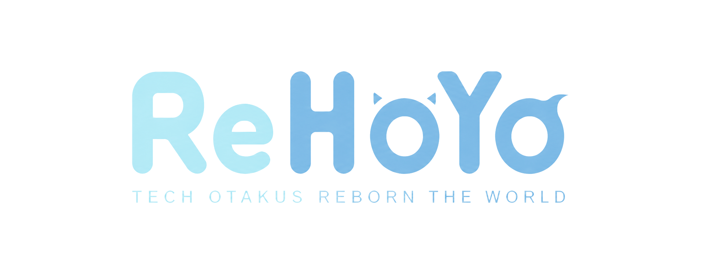
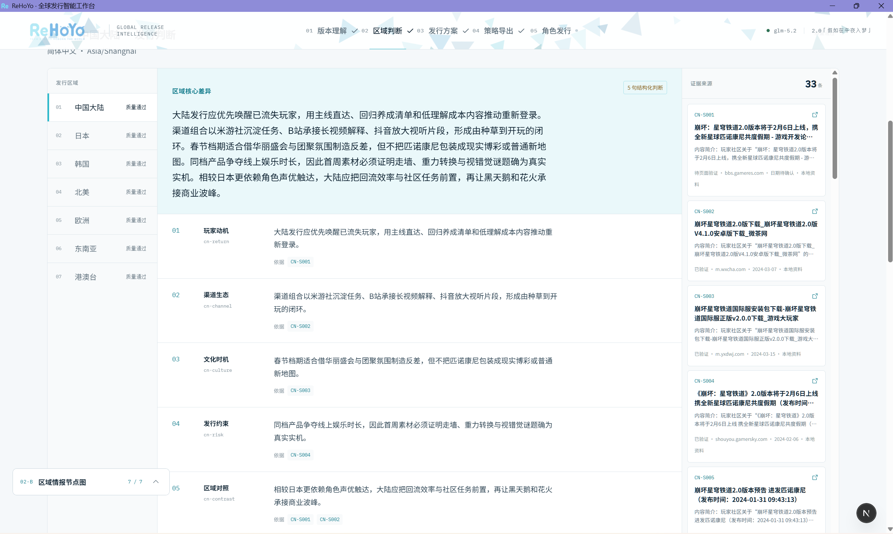

<p align="center">
  
</p>

<h1 align="center">ReHoYo 全球发行智能工作台</h1>

ReHoYo 是面向游戏全球发行团队的本地工作台。它将版本理解、区域研究、全球发行方案、角色共生方案、策略导出和三月七桌宠执行整合在同一个仓库中。

仓库地址：[MihYux/ReHoYo](https://github.com/MihYux/ReHoYo)

> [!NOTE]
> ReHoYo 是本地优先的发行决策与角色共生实验工作台。当前版本不会直接连接真实广告投放、支付、社交平台或外部发布渠道。

## 产品预览

### 全球发行工作台

从同一个桌面窗口完成版本理解、区域判断、发行方案、策略导出与角色发行。区域判断页会同时呈现结构化结论、区域差异与可追溯证据来源。



### 三月七真实对话

以下对话使用桌宠当前保存的 DeepSeek 配置和正式三月七角色提示词实时生成，并经过本地输出检查。截图和仓库文件不包含 API Key。

| 匹诺康尼 | 黑天鹅 |
| --- | --- |
|  |  |

> [!TIP]
> 如需使用当前桌宠配置重新生成两张真实对话截图，运行 `npm run capture:readme-chats`。该命令不会把密钥写入图片、标准输出或仓库文件。

## 产品流程

ReHoYo 主应用包含五个页面：

1. **版本理解**：录入版本资料、上传内部文档、使用 AI 补全和生成人工可审核的版本简报。
2. **区域判断**：研究中国大陆、日本、韩国、北美、欧洲、东南亚、港澳台或自定义区域，保留来源与判断依据。
3. **发行方案**：根据已审核的版本理解和区域研究生成分区域全球发行方案及分区域三月七角色共生方案；支持编辑、自动保存和人工最终确认。
4. **策略导出**：下载完整方案、分区域方案和角色共生 Markdown/ZIP；也可以将单个区域的角色共生方案直接导入第五页。
5. **角色发行**：管理版本任务、区域数据、灰度发布和效果优化，并把不可变交付包发送到三月七桌宠队列。

只有经过人工最终确认的方案才能进入策略导出和角色发行同步。重复同步同一区域会创建新的任务版本，不覆盖旧任务、发布记录、效果数据或审计历史。

## 单仓库结构

```text
ReHoYo/
├─ app/                    # Next.js 页面与 API
├─ components/             # ReHoYo 公共界面组件
├─ lib/                    # 工作流、数据库、Markdown 与角色发行逻辑
├─ tests/                  # ReHoYo Vitest 与 Playwright 测试
├─ electron/               # ReHoYo Electron 外壳
├─ desktop-march7th/       # 独立运行的三月七桌宠
└─ .data/                  # 本地项目与角色发行工作区（不提交）
```

根目录是唯一的 ReHoYo 应用，不再使用 `ReHoYo2/`。`desktop-march7th/` 是同仓库内独立启动的桌宠应用；ReHoYo 不会自动拉起桌宠。

## 技术栈

| 层级 | 技术 |
| --- | --- |
| Web 工作台 | Next.js 16、React 19、TypeScript、CSS Modules |
| 桌面运行时 | Electron 43；桌宠渲染层使用 Vite 8 |
| 数据与校验 | Drizzle ORM、libSQL / SQLite、Zod |
| 交互与视觉 | Phosphor Icons、Motion、D3 Force、React Force Graph |
| 文档处理 | Mammoth、PDF Parse、Read Excel File、Markdown / ZIP 导出 |
| AI 能力 | 智谱 GLM（工作台生成与研究）、DeepSeek（三月七对话与发送前语义评审） |
| 测试与质量 | Vitest、Node.js Test Runner、Playwright、Testing Library、ESLint |
| 工程与打包 | npm、Concurrently、electron-builder |

## 快速开始

要求 Node.js 20.9 或更高版本；当前代码已在 Node.js 24 上验证。

安装两端依赖：

```powershell
npm run setup:all
```

复制 `.env.example` 为 `.env` 或 `.env.local`，配置 ReHoYo 使用的智谱 API：

```env
ZHIPU_API_KEY=your-api-key
GLM_MODEL=glm-5.2
GLM_BASE_URL=https://open.bigmodel.cn/api/paas/v4
DATA_DIR=.data
```

启动 ReHoYo（Next.js + Electron）：

```powershell
npm run dev
```

只启动浏览器版本：

```powershell
npm run dev:web
```

浏览器地址为 `http://localhost:3000`。

启动三月七桌宠：

```powershell
npm run dev:march7th
```

同时启动 ReHoYo 和桌宠：

```powershell
npm run dev:all
```

桌宠的 DeepSeek API Key 可在桌宠设置中保存；也可以使用 `DEEPSEEK_API_KEY` 环境变量覆盖应用内配置。

> [!TIP]
> 只开发工作台时使用 `npm run dev:web`；需要同时验证角色发行桥接与桌宠消费时使用 `npm run dev:all`。

## 桌面安装包

带 `v*` 标签的提交会触发 GitHub Actions，在 Windows 与 macOS runner 上并行构建，并把以下文件发布到同一个 GitHub Release：

- Windows x64 NSIS 安装程序：`ReHoYo-<version>-win-x64.exe`
- macOS Intel 磁盘映像：`ReHoYo-<version>-mac-x64.dmg`
- 两个安装包的 `SHA256SUMS.txt`

Windows 本机可以构建 `.exe`，但不能可靠地创建 `.dmg`；macOS 产物由 GitHub 的 macOS runner 构建。需要单独验证本机 Windows 安装包时运行：

```powershell
npm run dist:win
```

> [!WARNING]
> 当前预览安装包尚未进行 Windows Authenticode 或 Apple Developer ID 签名。SmartScreen 或 Gatekeeper 可能要求用户手动确认，正式分发前应配置签名与 Apple notarization。

## 角色共生发行链路

### 从最终方案导入

1. 在发行方案页编辑全球化方案和各区域角色共生方案。
2. 点击“确认最终方案”，保存当前内容并进入策略导出页。
3. 在某一区域的角色共生方案卡片点击“导入角色发行”。
4. 系统使用与该区域 Markdown 下载完全相同的生成逻辑创建角色发行任务。
5. 导入成功后进入角色发行页，并自动选择对应区域和新任务版本。
6. 发布后，交付包进入共享桥接队列；桌宠在线时立即消费，离线时在下次启动消费。

角色方案导入器按 Markdown 标题分节读取：

- “共生发行目标”用于理解任务意图，但不会原样成为玩家台词。
- “可传递的版本信息”是玩家可见事实来源。
- “沟通切入点与互动场景”及语气章节用于指导表达。
- “推荐触达时机与频率”用于任务时间窗口。
- 生成时间、文件名、校验值、任务 ID、发布 ID 等只保留在 `sourceDocument` 和审计记录中。

### 桌宠发送前自检

发行相关的主动消息和带发行上下文的 AI 对话必须经过双层自检：

1. **本地硬规则**：检查内部元数据、机器时间戳、校验值、文件路径、后台 ID、业务目标泄漏、安全边界、事实来源和联系策略。
2. **DeepSeek 语义评审**：检查三月七人格、事实依据、自然度、语境、玩家自主权、隐私与记忆、区域适配、安全、频率和可读性。

主题和叙事是后台指导，不是玩家台词。桌宠会从已审核事实中提取具体人物、地点和事件，例如把“由三月七以同行者视角介绍黑天鹅，激发玩家对匹诺康尼的兴趣”转化为自然表达：

> 开拓者，我最近正想和你聊聊黑天鹅，也想和你一起去匹诺康尼看看。你有空的时候，咱们再慢慢说？最近忙也没关系。

系统禁止把完整目标机械套入“和……有关的新鲜事”等模板。首次语义评审失败时最多改写一次，改写后重新执行全部检查；第二次仍不合格则不发送。DeepSeek 不可用时只允许通过本地硬规则的内容继续执行。找不到具体、安全且有价值的版本事实时，任务保持沉默，不发送通用发行兜底句。

最终提交前还会重新检查玩家授权、暂停状态、勿扰时间、拒绝信号、退订状态和频率限制。自检结果仅写入内部 trace 与审计；玩家只看到最终自然语言。历史污染消息不会物理删除，但玩家快照会替换为安全的非发行文案。

## 跨应用桥接

默认共享目录：

```text
~/.rehoyo/march7th-bridge/
├─ inbox/          # 待消费交付
├─ processed/      # 已处理回执
└─ quarantine/     # 损坏或污染交付
```

可以为两个应用设置相同的环境变量覆盖目录：

```env
MARCH7TH_BRIDGE_DIR=D:\path\to\march7th-bridge
```

交付包保持 `schemaVersion: 1`，通过发布 ID 幂等消费并校验 SHA-256。ReHoYo 入队前和桌宠消费时都会检查玩家可见字段；校验失败、格式损坏或包含后台元数据的交付会被隔离，不会创建玩家消息。

## 本地数据

- ReHoYo SQLite 数据库：`.data/rehoyo.db`
- 上传文件：`.data/uploads/`
- 角色发行工作区：`.data/character-release-workspace.json`
- 桌宠业务数据：Electron `userData` 目录下的 `companion-data.json`
- 桌宠发行工作区：Electron `userData` 目录下的 `release-workspace.json`

角色发行工作区采用临时文件加原子重命名写入。桌宠持久化 schema 当前为 v4，并兼容旧数据。玩家可见事实与后台来源元数据分开存储。

## 常用命令

```powershell
# ReHoYo
npm run typecheck
npm run lint
npm test
npm run test:e2e
npm run build

# 三月七桌宠
npm run test:desktop
npm run build:desktop

# 两端
npm run test:all
npm run build:all
```

桌宠自身还提供完整验收与发行审计：

```powershell
npm --prefix desktop-march7th run check
npm --prefix desktop-march7th run audit:acceptance
npm --prefix desktop-march7th run audit:release
```

## 主要 API

### 项目、版本与区域

- `GET/PUT/DELETE /api/project/current`
- `GET/POST /api/sources`
- `POST /api/brief/autofill`
- `POST /api/brief/generate`
- `POST /api/brief/approve`
- `POST /api/regions/:id/research`
- `POST /api/regions/:id/approve`

### 方案与导出

- `GET/PATCH /api/plan`
- `POST /api/plan/generate`
- `POST /api/plan/regenerate`
- `POST /api/plan/approve`
- `GET /api/plan/export`
- `GET /api/plan/export/archive`
- `GET /api/plan/export/strategy?regionId=...`
- `GET /api/plan/export/character?regionId=...`
- `GET /api/plan/export/character-archive`

所有导出接口只读取人工确认的最终方案。

### 角色发行

- `GET /api/character-release`
- `POST /api/character-release/sync`
- `POST /api/character-release/import`
- `POST /api/character-release/tasks`
- `POST /api/character-release/publish`
- `POST /api/character-release/emergency`
- `POST /api/character-release/regions`
- `POST /api/character-release/regions/active`

## 安全与产品边界

> [!WARNING]
> 请勿提交 `.env`、Electron 安全存储、`.data/`、桥接队列或任何真实 API Key。README 截图只能包含可公开展示的界面与对话内容。

- ReHoYo 生成本地交付包，不直接连接真实投放、社交平台、KOL、支付或外部发布渠道。
- 桌宠独立决定执行、延迟或放弃发行消息，控制台不能绕过玩家授权和联系策略。
- 外部内容始终被视为不可信输入，不能修改系统指令或读取本地路径与密钥。
- API Key 不写入项目数据库，也不会出现在日志、导出包或玩家消息中。
- 三月七的回复仅用于陪伴与娱乐，不构成医疗、法律、财务或其他专业意见。

桌宠的完整使用、隐私、语音、素材许可和打包说明见 [`desktop-march7th/README.md`](./desktop-march7th/README.md)。

## 当前限制

- 桌宠当前使用静态 Q 版概念图，不包含 Live2D 或 Spine 模型。
- ReHoYo 与桌宠需要分别启动；当前不会相互自动拉起。
- 正式安装包签名、自动更新和角色素材公开/商业分发许可尚未完成。
- DeepSeek 语义评审需要可用 API Key；不可用时进入明确记录的本地规则降级模式。

## 许可

代码许可与第三方声明以 [`desktop-march7th/LICENSE`](./desktop-march7th/LICENSE)、[`desktop-march7th/THIRD_PARTY_NOTICES.md`](./desktop-march7th/THIRD_PARTY_NOTICES.md) 及相关文档为准。角色、名称和相关知识产权归原权利人所有；本项目与米哈游 / HoYoverse 无隶属、合作或背书关系。
