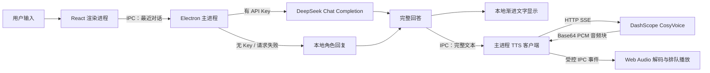

# 三月七桌宠（Desktop March 7th）

<p align="center">
  
</p>

一个基于 Electron、React 和 TypeScript 构建的透明桌面伙伴应用。

她会以置顶、无边框窗口的形式待在桌面边缘，可以被拖到合适的位置；点击角色或使用主面板会触发本地互动，在主面板打开聊天后可接入 DeepSeek 进行三月七风格的短对话，并使用阿里云百炼 CosyVoice 复刻音色朗读回复。

本仓库是 ReHoYo 角色同行计划中的桌面端子项目，当前重点是：

- 呈现三月七的视觉形象、角色语气和桌面交互方式；
- 提供无需联网也能使用的本地短句与规则回复；
- 接入可配置的 DeepSeek 对话能力；
- 接入低等待感的 CosyVoice 流式语音播放；
- 建立安全、可继续扩展的 Electron 主进程与渲染进程边界。

> [!IMPORTANT]
> 这是非官方同人项目，与米哈游 / HoYoverse 无隶属、合作或背书关系。角色及相关知识产权归原权利人所有。公开发布、商业使用或二次分发前，请自行核对最新二创规范及素材授权。

## 目录

- [项目状态](#项目状态)
- [核心能力](#核心能力)
- [界面与操作](#界面与操作)
- [快速开始](#快速开始)
- [接入 DeepSeek](#接入-deepseek)
- [接入 CosyVoice 语音](#接入-cosyvoice-语音)
- [回答与语音的协同方式](#回答与语音的协同方式)
- [角色设计](#角色设计)
- [数据流与技术架构](#数据流与技术架构)
- [安全与隐私](#安全与隐私)
- [配置参考](#配置参考)
- [开发、测试与打包](#开发测试与打包)
- [目录结构](#目录结构)
- [常见问题](#常见问题)
- [当前限制](#当前限制)
- [素材与许可](#素材与许可)
- [后续计划](#后续计划)

## 项目状态

当前版本：`0.1.0`

当前阶段：可持续打磨的桌面端成品基线，尚未正式签名发布。

发行与内部演示工具不属于当前产品界面。底层数据兼容与历史测试暂时保留，避免旧数据迁移影响相册、通信和同行设置。

| 项目 | 状态 | 说明 |
| --- | --- | --- |
| macOS 本地开发与打包 | 已验证 | 当前主要开发和测试平台 |
| Windows 打包目标 | 已配置 | `electron-builder` 已配置 NSIS，但尚未在本仓库持续验证 |
| Linux 打包目标 | 已配置 | `electron-builder` 已配置 AppImage，但尚未在本仓库持续验证 |
| 本地角色互动 | 可用 | 不需要 API Key，也不依赖网络 |
| 共同旅行相册 | 可用 | 本地保存、引用控制、删除、清空和 JSON 导出 |
| 角色通信中心 | 可用 | 已审核消息分类、未读、收藏、反馈、偏好和来源追溯 |
| 首次进入与授权 | 可用 | 概念体验披露、内容授权、频率、勿扰、记忆和第一次选择 |
| 主动联系策略 | 可用 | 时区、跨午夜勿扰、每周上限、忽略沉默、降频、退订和抑制日志 |
| 桌宠系统能力 | 可用 | 位置记忆、四边吸附、托盘/右键菜单、多屏保护和状态反馈 |
| DeepSeek 对话 | 可用 | 需要用户自己的 DeepSeek API Key |
| CosyVoice 流式语音 | 可用但默认关闭 | 需要确认声音授权，并提供可访问目标音色的 DashScope API Key |
| 安全、隐私与成本门禁 | 可用 | 输入/输出审查、完整数据导出、按日预算、熔断和发布扫描 |
| 自动化质量检查 | 可用 | 领域规则、IPC 契约、生产构建和发布审计均纳入 `npm run check` |
| 安装包签名与自动更新 | 未实现 | 当前仅适合源码运行或本机打包 |
| Live2D 模型 | 未包含 | 当前使用仓库内的静态 Q 版概念图 |

仓库目前不提供正式签名安装包，也没有自动更新服务。第一次体验建议直接按照[快速开始](#快速开始)从源码运行。

## 核心能力

### 桌面窗口

桌宠窗口有两种模式，点齿轮在大面板与极简桌宠之间切换：

- **PET 模式（默认）**：`376 × 620`，相当于上一版默认尺寸的 `200%`，只露桌宠和窗口按钮；
- **PANEL 模式**：点齿轮后窗口扩到 `920 × 640`，展开主面板（左导航 + 右内容），桌宠作为大块置于左导航底部（设置项之下），与导航选项同列；点右上角返回箭头或按 `Esc` 缩回 PET 模式。

通用能力：

- 透明、无边框；PET 默认尺寸可在设置页允许的 `0.5–3` 倍范围内等比例选择，最大值会按当前显示器可用区域自动收紧，确保窗口完整可见；PANEL 模式固定为 `920 × 640`；
- 原生窗口边缘缩放保持关闭，避免破坏桌宠长宽比例；
- 默认置顶，可随时切换置顶状态；
- 自动保存并恢复窗口位置、置顶和边缘吸附偏好；
- 拖动结束后支持当前显示器四边吸附，并在显示器变化时保持窗口可见；
- macOS 下可显示在所有工作区，并允许出现在全屏空间；
- 支持最小化；托盘可用时关闭按钮会将窗口隐藏到托盘；
- 系统托盘和桌宠右键菜单可恢复窗口、暂停同行并打开主要功能；
- 支持从顶部拖动条、对话气泡、角色主体和透明空白区域拖动窗口；
- 角色区域采用 4 像素拖动阈值：短按触发互动，明显移动才开始拖窗。

### 角色互动

- 点击桌宠角色：随机触发一条日常短句；
- 在主面板（齿轮展开）左导航点“拍照”：触发拍照主题的角色回复，并立即把这次拍照保存为共同记忆（保存期间桌宠短暂显示“拍照中”状态）；
- 点“聊天 / 相册 / 通信 / 同行 / 设置”：在主面板右侧内容区打开对应页面；
- 根据内容切换四种情绪状态：
  - `bright`：元气、自然、亲切；
  - `soft`：温柔、认真、陪伴感；
  - `proud`：轻快、带一点小得意；
  - `curious`：好奇、活泼、思考中；
- 角色立绘带有轻量呼吸动画，播放语音时会增加说话状态反馈；
- 对话气泡里常驻一个状态标签，显示当前状态（陪伴中 / 四处看看 / 勿扰时间 / 同行已暂停 / N 封新通信 / 翻看记忆 等）；
- 返回极简桌宠可点右上角返回箭头或按 `Esc`；同组的减号和关闭按钮分别最小化、关闭桌面窗口。

### 共同旅行相册

- Electron 主进程将共同记忆持久化到独立业务数据文件；
- 初始体验提供共同选择和旅行照片两类示例记忆；
- 支持全部、选择、照片、明信片、节点、版本和回归筛选；
- 每条记忆展示日期与时间、摘要、三月七留言和用户确认状态；
- 可单独允许或禁止三月七未来引用某条记忆；
- 可关闭全部长期记忆；现有记录保留，但不会提供给角色或模型；
- 支持删除单条记忆和清空全部记忆；
- 删除记忆时同步移除通信消息中的可识别记忆 ID 引用；
- 支持将示例记忆导出为 JSON，不会混入聊天、API Key 或后台内部数据；
- 所有新增、授权变更和删除操作都会写入不含记忆正文的执行日志。

### 角色通信中心

- 与即时自由聊天完全分离，只展示 `approved` 且已经发送的角色消息；
- 支持全部、日常、旅行、版本和收藏筛选；
- 主面板的通信入口显示未读角标，打开消息后持久化已读状态；
- 支持喜欢、收藏和稍后再看；
- 支持“不感兴趣”“降低频率”和“不再接收此类”固定反馈；
- 降低频率会写入对应内容类型的偏好，退订会从允许内容类型中移除；
- 对关联版本内容选择“不感兴趣”时，会停止后续版本联系；
- 消息详情可以追溯审核状态、Skill 版本、模板、规则、记忆和固定事实；
- 照片类消息可以直接打开关联的共同旅行相册；
- 任意自由文本不能作为通信反馈进入主进程，只接受固定回复枚举。

### 首次进入、授权与关系控制

- 新安装不会在授权前预置共同记忆或主动消息；
- 欢迎页明确说明概念体验、模拟数据、DeepSeek 和 DashScope 数据流；
- MVP 只提供三月七，并展示角色可能执行与明确不会执行的行为；
- 玩家可以选择主动联系、日常、旅行、版本、召回、个性化和长期记忆；
- 默认每周最多两次主动消息，勿扰时间为 `22:00～09:00`；
- 低频召回默认关闭，必须单独开启；
- 第一次同行选择只有在长期记忆开启时才写入相册；
- 同行设置支持随时修改称呼、授权、内容、频率和勿扰；
- 支持暂停、恢复、退出同行和删除全部关系数据；
- 支持导出完整同行业务数据，不包含 API Key、音频缓存或自由聊天；
- 删除关系数据不会删除独立保存的模型或语音 API Key 设置。

### 主动联系、频率与沉默

- 主动联系先进入关系事件队列，再由统一策略决定允许发送或保持沉默；
- 策略依次检查首次授权、暂停状态、主动联系授权、召回授权、内容类型、勿扰时间、安静期、每周上限、内容降频和重复模板；
- 勿扰时间按照玩家所选时区计算，支持 `22:00～09:00` 这类跨午夜范围；
- 每周主动消息上限可配置为 `0～7`，玩家主动打开应用、点击角色、拍照或发起聊天不会占用该额度；
- 连续忽略两次主动联系后自动进入七天安静期；玩家重新主动互动后可以提前结束安静期；
- “降低频率”会在十四天内抑制对应内容类型，“不再接收”会直接关闭该类型；
- 同一模板七天内不会重复主动发送；
- 每次允许或抑制都会写入机器可读的原因和执行日志，设置页会显示当前联系状态；
- 后台内容和模型都不能绕过玩家授权、勿扰、退订、频率或安静期。

### 本地回复

即使没有配置任何模型，桌宠也能正常启动和互动。

本地回复会识别问候、自我介绍、拍照、疲惫或难过、记忆、称赞和告别等常见主题，并从预设短句中选择符合三月七语气的回复。模型调用失败、余额不足、网络异常或超时时，也会自动回退到本地回复。

### DeepSeek 对话

- 默认模型：`deepseek-v4-flash`；
- 可切换：`deepseek-v4-pro`；
- 可控制深度思考模式；
- 日常陪聊默认关闭深度思考，以降低等待时间；
- 每次回复最多请求 `320` 个输出 token；
- 返回文字最多保留 `1500` 个字符；
- 模型请求超时为 `45` 秒；
- API Key 只由 Electron 主进程读取和使用；
- 提示词提取、越界内容、依赖/付费操纵和专业结论请求在调用前由本地门禁处理；
- 模型输出还会再次检查内部信息、外链、排他依赖、付费换亲密和专业保证；
- 每日最多 `60` 次、`120000` 个输入字符；连续三次服务失败会熔断五分钟；
- 模型不可用时不会阻塞本地桌宠功能。

### CosyVoice 复刻语音

- 模型：`cosyvoice-v3.5-flash`；
- 中文提示：`zh`；
- 日常流式格式：`24 kHz PCM`；
- 设置试听格式：`WAV`；
- 语音输出和自动朗读默认关闭，启用前必须确认声音样本与复刻音色授权；
- 支持语音总开关、自动朗读、音量和语速控制；
- 气泡与每条三月七消息都有独立的播放 / 停止按钮；
- 播放新文本时会取消上一条远端合成和本地播放；
- 回复到达后立即启动 TTS，同时逐步显示文字，用视觉反馈覆盖首个音频块的等待；
- 不直接朗读 Markdown 符号、代码块或链接地址；
- 根据 `bright`、`soft`、`proud`、`curious` 情绪向 CosyVoice 发送不同的语气指令；
- 每日最多 `120` 次、`50000` 个待朗读字符；连续三次服务失败会熔断五分钟。

## 界面与操作

### PET 模式（桌宠主界面）

主界面保持极简，右上角集中放置设置、最小化和关闭按钮：

| 图标 | 功能 |
| --- | --- |
| 齿轮 | 展开主面板（窗口扩大为 PANEL 模式） |
| 减号 | 最小化窗口 |
| 关闭 | 托盘可用时收起到系统托盘 |

气泡右侧的“对话”按钮可直接展开输入框；这里的草稿、消息和角色回复与主面板聊天页使用同一份交流记录。其余功能（语音、置顶、拍照、相册、通信、同行、设置）收进主面板的左导航。

### 角色区

- 单击角色：触发随机互动；
- 在角色上按住并移动：拖动整个桌宠窗口；
- 在桌宠任意非输入区域单击右键：打开桌面控制菜单。

### 主面板（PANEL 模式，齿轮展开）

采用类资源管理器的 master-detail 布局：左侧是功能导航（语音/置顶/拍照/聊天/相册/通信/同行/设置），右侧显示当前选中功能的内容；桌宠精灵作为大块置于左导航底部（设置项之下），与导航选项同列。

- **快捷开关**：语音（开关）、置顶（开关）；
- **动作**：拍照；
- **功能**：聊天、相册、通信（带未读角标）、同行、设置——点哪一项，右侧就显示对应内容；
- 右侧内容区直接承载各功能页面（聊天、相册、通信中心、同行设置、模型与语音设置），不再是独立覆盖层；
- 左侧导航保留原有的角色化渐变、粉紫选中态和开关样式；右侧相册、通信、同行和设置等子界面采用白色、中性灰和细边框的扁平化视觉；
- 右上角依次提供返回、最小化和关闭按钮。

### 设置

- 原“模型设置”统一更名为“设置”，模型、API Key 和语音选项归入“模型与对话”分区；
- PET 主界面不再提供临时缩放按钮和展开滑杆，避免窗口尺寸状态相互干扰；
- “默认桌宠大小”只保留在设置页，可在应用允许的比例范围内自由选择；
- 调整默认尺寸会立即同步当前桌宠尺寸，并写入本地窗口状态；
- 设置页沿用主面板统一的返回、最小化和关闭逻辑。

首次同行引导同样采用扁平化设计，使用中性底色、细边框和轻阴影，同时保留三月七相关内容中的少量粉色强调。

### 共同旅行相册

- 顶部总开关控制长期记忆是否可以被角色使用；
- 每张卡片可以单独关闭未来引用或删除；
- 顶部分类按钮用于筛选不同记忆类型；
- 底部支持导出记忆 JSON 和清空全部记忆；
- 删除与清空无法撤销，应用会在操作前再次确认；
- 浏览器单独预览渲染页面时只显示只读布局数据，真实保存和导出仅在 Electron 应用中可用。

### 角色通信中心

- 左侧消息列表显示类型、标题、时间、未读和收藏状态；
- 顶部可以在全部、日常、旅行、版本和收藏之间筛选；
- 右侧显示消息正文、关联行动、喜欢、收藏和稍后再看；
- “不感兴趣”和“不再接收此类”会在执行前再次确认；
- 展开“查看内容来源与审核记录”可以检查消息追溯信息；
- 只有经过审核并已发送的消息会进入玩家通信中心。

### 首次进入与同行设置

- 首次启动必须先确认概念体验和数据说明；
- 选择三月七后配置联系内容、频率、勿扰、个性化与记忆；
- 最后选择第一次同行方式，建立第一条可控共同记忆；
- 后续通过“同行”入口修改授权，或暂停、退出和删除关系数据。

### 对话气泡

- 显示当前角色回复和情绪状态；
- 可在气泡空白处按住拖动窗口；
- 右上角喇叭按钮只播放当前气泡绑定的完整文本；
- 当回复正在逐字显示时，播放按钮仍绑定完整回答，不会只朗读已显示的半句话。

### 聊天面板

- 输入内容后按 `Enter` 或点击发送按钮；
- 输入长度上限为 `120` 个字符；
- 请求或文字渐进显示进行中时，输入框会暂时锁定；
- 当前窗口内存最多保留最近 `10` 条消息，面板显示最近 `5` 条；关闭应用后不会写入本地数据库；
- 每条三月七消息旁边都有独立语音按钮；
- 模型回复、模型失败回退和本地回复会显示不同的状态提示。

## 快速开始

### 环境要求

- Node.js `20` 或更高版本；
- npm；
- 支持 Electron 的桌面系统；
- 如需在线对话：可用的 DeepSeek API Key；
- 如需语音：可用的 DashScope API Key，以及该 Key 有权访问的 CosyVoice 音色。

### 获取代码

```bash
git clone https://github.com/MihYux/desktop-march-7th.git
cd desktop-march-7th
npm install
```

### 启动完整桌面应用

```bash
npm run dev
```

该命令会同时启动：

1. Vite 渲染页面开发服务器；
2. Electron 桌面主进程；
3. 带透明窗口、系统安全存储、模型 IPC 和语音 IPC 的完整桌宠。

> [!NOTE]
> 不要用 `npm run dev:renderer` 代替完整桌面启动。单独运行渲染页面只适合检查布局；浏览器环境没有 Electron IPC，因此设置保存、系统安全存储、窗口移动和语音播放会不可用。

### 启动生产构建

```bash
npm start
```

该命令会先执行生产构建，然后用 Electron 打开 `dist/` 中的页面。

### 只验证代码

```bash
npm run check
```

该命令会运行全部测试、TypeScript 编译和 Vite 生产构建。

## 接入 DeepSeek

### 通过界面配置 DeepSeek

1. 前往 [DeepSeek 开放平台](https://platform.deepseek.com/)创建 API Key；
2. 使用 `npm run dev` 或 `npm start` 启动桌面应用；
3. 点击右上角齿轮；
4. 在 DeepSeek 设置中选择模型；
5. 填写 API Key；
6. 按需开启“深度思考”；
7. 点击“保存并测试”。

连接测试成功后，聊天面板顶部会显示“DeepSeek 对话”。API Key 输入框留空再次保存时，会保留原有 Key。

### 可选模型

| 模型标识 | 项目中的用途 |
| --- | --- |
| `deepseek-v4-flash` | 默认选择，适合日常短对话 |
| `deepseek-v4-pro` | 可选模型，适合需要更高回答质量的场景 |

项目只允许使用上述两个模型标识。模型名称和请求格式以 [DeepSeek Chat Completion 官方文档](https://api-docs.deepseek.com/api/create-chat-completion/)为准。

### 深度思考

DeepSeek 接口的思考模式在项目中通过以下参数控制：

```json
{
  "thinking": {
    "type": "enabled"
  },
  "reasoning_effort": "high"
}
```

关闭时发送：

```json
{
  "thinking": {
    "type": "disabled"
  }
}
```

角色的日常对话通常只有一到三句，默认关闭思考可以减少等待时间。复杂问题可以在设置里临时开启。

### 使用环境变量

应用也支持在启动前提供：

```text
DEEPSEEK_API_KEY
```

环境变量优先级高于应用内保存的 Key。使用环境变量时，设置面板不会提供“清除”按钮；要更换或移除它，需要在启动应用的终端或系统环境中修改变量并重新启动应用。

不要把 API Key 写进源码、README、Git 提交或公开的 `.env` 文件。

### 请求行为

当前模型请求使用完整响应模式：

```json
{
  "stream": false,
  "max_tokens": 320
}
```

这意味着应用会先取得完整回答，再把完整文本同时交给渐进显示逻辑和 TTS。界面上的逐字效果是本地显示动画，不是丢字，也不是模型 token 流。

发送给 DeepSeek 的内容包括：

- 三月七角色系统提示词；
- 最近的必要对话上下文；
- 当前用户消息。

不会发送：

- DeepSeek API Key 之外的本机凭据；
- DashScope API Key；
- 本地文件；
- Live2D 压缩包；
- 未主动输入到聊天中的桌面内容。

## 接入 CosyVoice 语音

### 当前默认配置

配置文件位于 [`shared/cosyvoice-config.json`](./shared/cosyvoice-config.json)：

```json
{
  "provider": "dashscope",
  "baseUrl": "https://dashscope.aliyuncs.com/api/v1",
  "model": "cosyvoice-v3.5-flash",
  "voiceId": "cosyvoice-v3.5-flash-marchpet-eb86bcaeea5f40669b1798191950529a",
  "format": "wav",
  "streamingFormat": "pcm",
  "sampleRate": 24000,
  "language": "zh"
}
```

日常播放使用阿里云百炼 HTTP SSE：请求头携带 `X-DashScope-SSE: enable`，主进程持续接收音频块。接口格式可参考[阿里云 CosyVoice HTTP API 文档](https://help.aliyun.com/zh/model-studio/cosyvoice-tts-http-api)。

### 通过界面配置 CosyVoice

1. 在阿里云百炼获取 DashScope API Key；
2. 启动完整 Electron 桌面应用；
3. 点击右上角齿轮；
4. 滚动到“CosyVoice 复刻音色”；
5. 阅读并勾选“声音使用授权确认”；
6. 填写 DashScope API Key；
7. 调整语音输出、自动朗读、语速和音量；
8. 点击“保存并试听”。

试听会使用完整 WAV 模式生成固定测试语句。正常聊天会使用 PCM 流式模式。

### API Key 读取优先级

语音模块按以下顺序读取 Key：

1. `DASHSCOPE_API_KEY` 环境变量；
2. 当前运行期间的内存 Key；
3. Electron `safeStorage` 加密保存的 Key；
4. macOS 钥匙串中：
   - 服务名：`desktop-march-7th-dashscope`
   - 账户名：当前系统用户；
5. 未配置。

如果安全存储不可用，从设置界面输入的新 Key 只会保留在当前运行期间。macOS 钥匙串是在应用启动时读取的，手动修改后需要重启桌宠。

### 关于仓库中的复刻音色 ID

`voiceId` 可以公开，但不等于所有 DashScope 账号都能调用。

仓库当前绑定的是本项目创建时生成的专属复刻音色。它可能只对创建该音色的阿里云账号、地域或业务空间有效。其他人克隆仓库后，即使自己的 DashScope API Key 有效，也可能收到音色无权限或音色不存在的错误。

如果你的 Key 无法访问当前音色，请：

1. 按照[阿里云声音复刻指南](https://help.aliyun.com/zh/model-studio/voice-cloning-user-guide)在自己的账号中创建音色；
2. 确保声音复刻和语音合成使用兼容的模型与地域；
3. 把 `shared/cosyvoice-config.json` 中的 `voiceId` 替换成自己的音色 ID；
4. 如果使用业务空间专属端点，同时替换 `baseUrl`；
5. 重新启动应用并再次“保存并试听”。

业务空间端点通常类似：

```text
https://<WorkspaceId>.cn-beijing.maas.aliyuncs.com/api/v1
```

不要把 DashScope API Key、临时 OSS 签名链接或声音样本提交到仓库。

### 语音控制

| 设置 | 默认值 | 说明 |
| --- | ---: | --- |
| 声音使用授权确认 | 未确认 | 未确认时禁止启用和试听 |
| 语音输出 | 关闭 | 控制是否允许生成和播放语音 |
| 自动朗读 | 关闭 | 新回复到达后自动启动流式语音 |
| 音量 | `0.86` | 本地 Web Audio 输出增益，范围 `0–1` |
| 语速 | `1.0` | UI 提供 `0.9×`、`1.0×`、`1.1×`；主进程接受 `0.7–1.3` |
| 采样率 | `24000 Hz` | 流式 PCM 和试听请求使用 |
| 单次文本上限 | `600` 字符 | 超出部分在语音合成前截断 |

## 回答与语音的协同方式

当前设计的目标不是让模型 token 流式返回，而是减少 TTS 首包延迟带来的“停住不动”感。

工作流程如下：

1. DeepSeek 返回完整回答，或本地规则生成完整回答；
2. 应用立即把完整文本交给 CosyVoice；
3. 同时在气泡和聊天消息中启动本地打字机效果；
4. CosyVoice 首个 PCM 音频块到达后立即开始播放；
5. 后续音频块由 Web Audio API 依次排队；
6. 文字最终完整显示，不会因为动画中断而只保留半句话。

渐进显示通常持续约 `1–2` 秒：

- 先保留约 `100 ms` 的准备时间；
- 普通回复按字符显示；
- 超过 `120` 个字符的回复会按两个字符一组显示；
- 每帧间隔会根据文本长度在约 `22–58 ms` 之间调整；
- emoji 会作为完整字符显示，不会拆成乱码。



### 语音流实现

- 主进程解析 DashScope SSE `data:` 事件；
- `sentence-begin` 用于记录句子边界；
- 携带音频数据的事件会立即转发给渲染进程；
- 渲染进程把 Base64 PCM16 little-endian 数据解码成 `Float32Array`；
- 每个音频块被转换成 `AudioBuffer`，再按时间顺序播放；
- 如果一个音频块恰好在 16 位采样边界中间结束，会保留最后一个字节并与下一块拼接；
- 用户点击停止、切换文本或关闭窗口时会取消远端请求并停止本地音频节点。

## 角色设计

角色语气依据 [HeartEase1/March7th.Skill](https://github.com/HeartEase1/March7th.Skill) 蒸馏，并由共享提示词统一约束。

提示词位于 [`shared/march7th-prompt.json`](./shared/march7th-prompt.json)，本地回复规则位于 [`src/character/march7th.ts`](./src/character/march7th.ts)。

### 语言风格

- 以第一人称“咱”自然交谈；
- 偶尔使用“本姑娘”，但避免重复卖萌；
- 轻快、俏皮、亲近，会轻轻吐槽但不刻薄；
- 优先短句和现场感，模型回复尽量控制在三句以内；
- 喜欢拍照、日记、伙伴和旅途中产生的新回忆；
- 对方难过，或话题涉及记忆、同伴、离别时，会转为认真、坚定和柔软；
- 不编造没有公开定论的身世、剧情或人物关系；
- 遇到越界内容时简短拒绝，再把话题带回健康的日常互动。

### 本地与模型共用的角色状态

应用会根据回复文本推断情绪，并把状态同时用于：

- 气泡情绪标签；
- 角色界面表现；
- TTS `instruction` 语气提示；
- 聊天消息的重播语气。

因此，模型回复和本地回复在视觉与声音上会保持相近的角色一致性。

## 数据流与技术架构

### 技术栈

| 层级 | 技术 |
| --- | --- |
| 桌面容器 | Electron 43 |
| UI | React 19 |
| 开发与构建 | Vite 8 |
| 类型系统 | TypeScript 7 |
| 动画 | Motion for React |
| 图标 | Phosphor Icons |
| 测试 | Vitest + Node.js Test Runner |
| 打包 | electron-builder |
| 对话服务 | DeepSeek Chat Completion API |
| 语音服务 | DashScope CosyVoice HTTP SSE |
| 音频播放 | Web Audio API |

### 进程边界

项目采用标准 Electron 隔离结构：

#### Electron 主进程

负责：

- 创建透明置顶窗口；
- 移动、最小化、关闭和切换置顶；
- 读取、加密和保存模型 / 语音设置；
- 读取、校验、原子写入和恢复角色同行业务数据；
- 执行记忆授权、删除、清空、照片保存和导出；
- 调用 DeepSeek；
- 调用 DashScope；
- 执行对话输入/输出安全审查、按日预算和失败熔断；
- 解析 TTS SSE；
- 校验外部响应；
- 管理语音流取消。

#### Preload

通过 `contextBridge` 暴露最小化的 `window.marchDesktop` API。渲染页面只能调用预定义能力，不能直接访问 Node.js、文件系统或 Electron 主进程对象。

#### React 渲染进程

负责：

- 桌宠视觉与动画；
- 聊天记录和输入；
- 设置面板；
- 共同旅行相册和记忆筛选；
- 渐进文字显示；
- PCM 解码；
- Web Audio 排队播放；
- 用户点击、拖动和停止操作。

### 本地数据

| 数据 | 存储方式 | 生命周期 |
| --- | --- | --- |
| 当前聊天记录 | React 内存 | 应用退出或页面重载后消失 |
| 共同记忆、消息、关系和执行日志 | Electron `userData` 目录中的 `companion-data.json` | 持久保存，可重置 |
| 模型和语音开关 | Electron `userData` 目录中的 JSON | 持久保存 |
| 第三方调用计数与熔断 | Electron `userData` 目录中的 `service-usage.json` | 不保存正文，跨日重置计数 |
| 窗口位置、尺寸、置顶和吸附 | Electron `userData` 目录中的 `window-state.json` | 持久保存 |
| 加密 API Key | JSON 中的 `safeStorage` 密文 | 可持久保存 |
| 安全存储不可用时的 Key | 主进程内存 | 应用退出后消失 |
| macOS DashScope Key | 系统钥匙串 | 由系统管理 |
| 生成的日常语音 | 内存中的 PCM / AudioBuffer | 播放结束后释放 |
| 语音试听 | 内存中的 Data URL | 当前设置面板生命周期 |

设置文件名为：

```text
ai-settings.json
companion-data.json
tts-settings.json
service-usage.json
window-state.json
```

它们位于 Electron 的 `app.getPath("userData")` 目录，不在项目仓库内。

## 安全与隐私

### Electron 安全配置

窗口启用了：

```text
contextIsolation: true
nodeIntegration: false
sandbox: true
```

这些设置用于减少渲染页面直接访问本机能力的范围。

### API Key 保护

- Key 不写入仓库配置；
- Key 不通过公共设置接口返回给渲染页面；
- 可用时使用 Electron `safeStorage` 加密；
- 设置文件以 `0600` 权限写入；
- 写设置时先写临时文件，再原子替换正式文件；
- 安全存储不可用时，新 Key 只保存在主进程内存；
- 环境变量始终优先，因此应用内“清除”不会删除系统环境变量；
- macOS 钥匙串中的 DashScope Key 由系统管理，不复制进项目文件。

### 网络与输入校验

- DeepSeek 模型使用白名单，不接受任意模型标识；
- 对话角色只接受 `user` 和 `assistant`；
- 上下文条目数量和单条文本长度有限制；
- 提示词提取、越界/未成年人内容、现实危机、专业结论和依赖/付费操纵请求在调用前本地处理；
- 模型输出中的内部信息、外链、排他依赖、付费换亲密和专业保证会被替换；
- DeepSeek 请求有超时和可读错误映射；
- TTS 文本会移除代码块、Markdown 标记和链接地址；
- TTS 请求 ID 必须符合限定格式；
- 非流式音频下载只信任 `aliyuncs.com` 域名，并强制使用 HTTPS；
- 音频下载和流式累计数据都有大小上限；
- 所有正在运行的 TTS 请求会在窗口关闭时取消；
- DeepSeek 与 DashScope 分别使用按日请求/字符预算，且连续失败会短暂熔断；
- `service-usage.json` 只记录计数和错误代码，不记录对话或朗读正文。

### 会发送到第三方服务的数据

| 服务 | 会发送 | 不会发送 |
| --- | --- | --- |
| DeepSeek | 角色提示词、必要对话上下文、当前消息 | DashScope Key、本地文件、音频样本 |
| DashScope | 待朗读文本、音色 ID、语速、语言和情绪指令 | DeepSeek Key、完整聊天历史、本地文件 |

如果不希望对话内容发送到第三方，请不要配置 DeepSeek，应用会保持本地回复模式。如果不希望文本发送到语音服务，请关闭“语音输出”。

更完整的说明与机器可读清单：

- [隐私说明](./docs/PRIVACY.md)
- [安全模型](./docs/SECURITY.md)
- [素材与许可登记](./docs/ASSET_AND_LICENSE_REGISTER.md)
- [平台与发布矩阵](./docs/PLATFORM_MATRIX.md)
- [PRD 36 条验收矩阵](./docs/ACCEPTANCE_MATRIX.md)
- [故障排查](./docs/TROUBLESHOOTING.md)
- [发布检查表](./docs/RELEASE_CHECKLIST.md)

## 配置参考

### DeepSeek

| 配置 | 当前值 |
| --- | --- |
| Provider | `deepseek` |
| Base URL | `https://api.deepseek.com` |
| Endpoint | `/chat/completions` |
| 默认模型 | `deepseek-v4-flash` |
| 可选模型 | `deepseek-v4-flash`、`deepseek-v4-pro` |
| 默认思考模式 | 关闭 |
| 请求模式 | 完整响应，`stream: false` |
| 输出上限 | `max_tokens: 320` |
| 返回文本上限 | `1500` 字符 |
| 超时 | `45 秒` |
| 每日预算 | `60` 次 / `120000` 输入字符 |
| 连续失败熔断 | `3` 次失败后暂停 `5` 分钟 |
| 环境变量 | `DEEPSEEK_API_KEY` |

### CosyVoice

| 配置 | 当前值 |
| --- | --- |
| Provider | `dashscope` |
| Base URL | `https://dashscope.aliyuncs.com/api/v1` |
| Endpoint | `/services/audio/tts/SpeechSynthesizer` |
| 模型 | `cosyvoice-v3.5-flash` |
| 音色 | 项目专属复刻 `voiceId` |
| 目标语言 | `zh` |
| 日常格式 | `pcm` |
| 试听格式 | `wav` |
| 采样率 | `24000 Hz` |
| 默认语速 | `1.0` |
| 默认音量 | `0.86` |
| 默认语音状态 | 关闭；需先确认声音授权 |
| 每日预算 | `120` 次 / `50000` 字符 |
| 连续失败熔断 | `3` 次失败后暂停 `5` 分钟 |
| 非流式超时 | `45 秒` |
| 流式超时 | `60 秒` |
| 环境变量 | `DASHSCOPE_API_KEY` |

### 可编辑配置文件

| 文件 | 用途 |
| --- | --- |
| `shared/march7th-prompt.json` | 模型角色提示词 |
| `shared/cosyvoice-config.json` | CosyVoice 模型、音色、端点和语言 |
| `src/character/march7th.ts` | 本地回复规则、短句和情绪 |
| `src/ui/reveal.ts` | 回答渐进显示节奏 |
| `src/ui/window-drag.ts` | 多区域拖动阈值和位置计算 |
| `electron/ai-client.cjs` | DeepSeek 请求约束 |
| `electron/content-safety.cjs` | 对话输入和模型输出本地安全门禁 |
| `electron/service-budget.cjs` | 按日调用预算与连续失败熔断 |
| `electron/tts-client.cjs` | TTS 请求、流解析和安全限制 |

## 开发、测试与打包

### npm scripts

| 命令 | 用途 |
| --- | --- |
| `npm run dev` | 经 `scripts/dev.cjs` 启动器同时拉起 Vite 与 Electron，完整开发模式 |
| `npm run dev:renderer` | 只启动 Vite，仅用于浏览器界面调试 |
| `npm run dev:electron` | 等待 `5173` 端口后启动 Electron |
| `npm run test` | 运行前端 Vitest 与 Electron Node 测试 |
| `npm run build` | TypeScript 编译并执行 Vite 生产构建 |
| `npm run check` | 依次执行测试、生产构建、36 条 PRD 验收审计和普通发布审计 |
| `npm run audit:acceptance` | 检查 36 条 PRD 标准的状态、顺序与自动化证据 |
| `npm run audit:release` | 扫描密钥、临时链接和受限素材，并验证许可/风险清单 |
| `npm run audit:release:strict` | 正式发布门禁；存在任何阻塞项时返回失败 |
| `npm start` | 构建后启动生产模式 Electron |
| `npm run package` | 构建并生成当前平台的未签名应用目录 |

### 测试范围

当前测试覆盖：

- 三月七本地回复分类与语气；
- DeepSeek 请求构造、上下文清理和错误映射；
- DeepSeek Key 加密与无安全存储回退；
- 提示词提取、危机/专业边界、依赖操纵和不安全模型输出拦截；
- DeepSeek/DashScope 请求、字符预算、跨日重置和连续失败熔断；
- CosyVoice 非流式合成；
- CosyVoice SSE 流式音频；
- 不受信任音频地址拦截；
- TTS 文本 Markdown 清理；
- DashScope Key 加密与 macOS 钥匙串读取；
- 复刻声音未确认授权时保持禁用；
- PCM16 little-endian 分块解码；
- emoji 安全的渐进文字显示；
- 渐进显示时长；
- 多区域窗口拖动阈值和坐标计算；
- 多显示器工作区选择、窗口边界约束、四边吸附和安全重启恢复；
- 桌宠照片、记忆、未读、勿扰与观察状态的优先级；
- 同行数据原子写入、损坏恢复、记忆和通信偏好；
- 全量隐私导出明确排除 API Key、音频缓存和自由聊天；
- 联系授权、跨午夜勿扰、频率、安静期、降频和重复抑制；
- preload 与主进程的 IPC invoke、send 和事件通道契约；
- 模态面板 Tab 焦点循环、`Esc` 关闭、背景 inert 与核心颜色对比度。

提交代码前建议执行：

```bash
npm run check
```

### 构建产物

```bash
npm run build
```

输出：

```text
dist/
```

### 本机应用目录

```bash
npm run package
```

输出：

```text
release/
```

`npm run package` 使用 `electron-builder --dir`，生成的是当前平台可运行的未签名应用目录，不是面向最终用户的正式安装包。

macOS 打包时如果没有 Developer ID，控制台会提示跳过代码签名；这是当前开发构建的预期行为。正式发布前需要配置应用图标、签名、公证和更新机制。

## 目录结构

```text
desktop-march-7th/
├── electron/
│   ├── main.cjs                 # Electron 窗口、IPC、AI/TTS 调度
│   ├── preload.cjs              # 受控 contextBridge API
│   ├── ai-client.cjs            # DeepSeek 客户端
│   ├── ai-settings.cjs          # DeepSeek 设置与安全存储
│   ├── content-safety.cjs       # 对话输入与角色输出安全门禁
│   ├── companion-store.cjs      # 角色同行业务数据、记忆操作与恢复
│   ├── contact-policy.cjs       # 联系授权、频率、勿扰与沉默决策
│   ├── service-budget.cjs       # 第三方调用预算与失败熔断
│   ├── window-state.cjs         # 窗口状态原子保存、多屏约束与吸附
│   ├── tts-client.cjs           # CosyVoice 完整/流式客户端
│   ├── tts-settings.cjs         # TTS 设置与安全存储
│   └── sse-parser.cjs           # SSE JSON 增量解析
├── public/
│   └── assets/
│       └── march7th-pet.png     # 当前桌宠概念图
├── shared/
│   ├── march7th-prompt.json     # 主进程与角色逻辑共用提示词
│   ├── march7th-skill-profile.json # 结构化 Skill、模板与素材清单
│   ├── privacy-manifest.json    # 本地文件、数据流与玩家控制
│   ├── release-risk-register.json # 负责人、状态和正式发布门禁
│   ├── prd-acceptance.json     # 36 条机器可读验收结果与证据
│   └── cosyvoice-config.json    # CosyVoice 公共配置
├── src/
│   ├── ai/
│   │   └── types.ts             # AI/TTS 前端类型
│   ├── audio/
│   │   └── pcm.ts               # PCM16LE 解码
│   ├── character/
│   │   └── march7th.ts          # 本地回复与情绪
│   ├── components/
│   │   ├── AlbumPanel.tsx
│   │   ├── CommunicationCenter.tsx
│   │   ├── CompanionOnboarding.tsx
│   │   ├── CompanionSettingsPanel.tsx
│   │   ├── MainPanel.tsx        # PANEL 模式主面板（左导航 + 右内容）
│   │   ├── ModelSettingsPanel.tsx
│   │   └── VoiceSettingsSection.tsx
│   ├── domain/
│   │   ├── pet-activity.ts      # 桌宠状态与勿扰反馈
│   │   ├── preview-data.ts      # 浏览器只读布局预览数据
│   │   ├── skill-profile.ts     # Skill Profile 完整性校验
│   │   └── types.ts             # 角色同行领域契约
│   ├── ui/
│   │   ├── contrast.ts          # WCAG 颜色对比度计算
│   │   ├── reveal.ts            # 渐进显示计划
│   │   └── window-drag.ts       # 多区域拖窗计算
│   ├── App.tsx                  # 主界面与交互状态
│   ├── main.tsx                 # React 入口
│   └── styles.css               # 透明窗口与界面视觉
├── LICENSE
├── THIRD_PARTY_NOTICES.md
├── docs/
│   ├── ACCEPTANCE_MATRIX.md     # PRD 36 条逐项验收
│   ├── IMPLEMENTATION_PLAN.md   # PRD 对齐路线、验收与风险清单
│   ├── PRIVACY.md               # 本地应用隐私说明
│   ├── RELEASE_CHECKLIST.md      # 正式发布门禁与人工复核
│   ├── SECURITY.md              # 安全边界、门禁和报告方式
│   ├── ASSET_AND_LICENSE_REGISTER.md
│   ├── PLATFORM_MATRIX.md
│   └── TROUBLESHOOTING.md       # 运行、模型、语音与打包排障
├── scripts/
│   ├── dev.cjs                  # 跨平台开发启动器，拉起 vite 与 electron
│   ├── acceptance-audit.cjs     # 验收编号、状态和证据扫描
│   └── release-audit.cjs        # 发布前密钥、素材与门禁扫描
├── CHANGELOG.md
├── package.json
└── vite.config.ts
```

同目录下的 `*.test.ts` 和 `*.test.cjs` 是对应模块的测试文件。

以下目录不会提交：

```text
node_modules/
dist/
release/
coverage/
tmp/
assets/reference/
```

## 常见问题

### 1. 为什么浏览器里能看到界面，但模型和语音按钮不可用？

你可能只启动了：

```bash
npm run dev:renderer
```

它只有 React 页面，没有 Electron preload 和主进程。请改用：

```bash
npm run dev
```

### 2. 为什么没有 DeepSeek API Key 也能聊天？

这是预期行为。未配置模型时会使用本地关键词与短句系统；模型失败时也会自动回退。本地模式不会把聊天内容发送给 DeepSeek。

### 3. DeepSeek 显示 Key 无效、余额不足或请求频繁怎么办？

- 在设置中重新保存并测试 Key；
- 检查 DeepSeek 开放平台中的 Key 状态；
- 检查账户余额；
- 等待限流恢复；
- 确认网络可以访问 `https://api.deepseek.com`；
- 如果设置了 `DEEPSEEK_API_KEY`，记得环境变量会覆盖应用内 Key。

### 4. 为什么模型回答不是 token 流式输出？

这是当前的主动设计。项目先获取完整回答，再立即启动 TTS，并用本地打字机动画渐进显示文字。这样 TTS 从一开始就拿到完整文本，语气和分句更稳定，同时用户仍能持续看到进度反馈。

### 5. 为什么文字在逐步显示，但喇叭播放的是完整回答？

这是预期行为。显示文本和朗读文本分开保存：界面只逐步展示，TTS 始终绑定完整回答。即使动画被其他操作打断，聊天记录也会自动补全全文。

### 6. DashScope Key 有效，为什么仍提示音色无权限？

仓库中的 `voiceId` 是专属复刻音色，可能不属于你的账号、地域或业务空间。请创建自己的复刻音色，并替换：

```text
shared/cosyvoice-config.json
```

中的 `voiceId`；使用专属业务空间时也要替换 `baseUrl`。

### 7. 为什么语音试听成功，但聊天朗读体验不同？

试听使用完整 WAV 合成后一次性播放；聊天使用 24 kHz PCM SSE 流，首块到达后立即播放。两者的网络路径、缓冲方式和播放时序不同，因此起播体验可能略有差异。

### 8. 为什么没有声音？

依次检查：

1. 主面板左侧的语音开关是否开启；
2. 设置中的“语音输出”是否开启；
3. 自动朗读是否开启；
4. DashScope Key 是否已配置；
5. “保存并试听”是否成功；
6. 音量是否为 `0`；
7. 当前 Key 是否有权访问目标音色；
8. 系统输出设备是否正确；
9. 网络是否可以访问 DashScope。

文字回复不会因为 TTS 失败而丢失。

### 9. 如何停止正在播放的语音？

再次点击当前处于播放状态的喇叭按钮。切换到另一条消息也会先停止旧语音，再合成新语音。

### 10. 为什么拖动角色时触发了互动，或者点击角色时没有互动？

角色区域使用约 4 像素的移动阈值：

- 尽量保持不动并松开：视为单击；
- 按住后明显移动：视为拖窗。

如果触控板容易产生微小位移，可以优先从气泡空白处或透明背景拖动。

### 11. 对话记录保存在哪里？

当前只保存在 React 内存中，不写数据库。关闭窗口或重启应用后会清空。模型和语音设置位于 Electron `userData` 目录，但聊天内容不写入这些设置文件。

### 12. 为什么项目里没有原始 Live2D 模型？

原模型只用于本地视觉参考，没有纳入仓库。没有 Live2D 文件不影响当前版本运行，因为程序使用的是：

```text
public/assets/march7th-pet.png
```

### 13. `npm run package` 为什么需要访问 GitHub？

`electron-builder` 可能需要下载对应版本的 Electron 运行时。如果网络或 DNS 阻止访问 GitHub，打包会失败；恢复网络后重新执行即可。

### 14. macOS 打包后为什么提示未签名？

当前项目没有配置 Apple Developer ID。源码开发不受影响，但正式分发前需要完成签名与公证。

## 角色化发行控制台

本地开发时，玩家桌宠与发行控制台使用两个独立入口：

```bash
npm run dev
npm run operator
npm run all
```

`npm run all` 会在同一 Electron 进程中同时打开玩家桌宠和发行控制台，避免两个独立进程并发写同一份本地数据。

发行控制台支持导入 DOCX、PDF、TXT、Markdown 或粘贴方案，逐段审核知识，锁定版本事实，使用受限模型生成候选文案，再经过自动检查与人工审批，按 5% / 25% / 100% 灰度发布不可变 `CampaignBundle`。玩家端只读取已批准的内容包，不会获得原始方案、知识片段或内部审核记录。

长期记忆采用候选确认制：聊天只会提出简短候选卡片，玩家明确确认后才进入长期记忆；发行引用还需要单独开启。全局 Kill Switch 会停止任务、撤销有效内容包并使待发送版本内容失效。

## 当前限制

- 当前视觉是单张概念图，不是 Live2D、Spine 或分层骨骼动画；
- 当前自由聊天仍只保留在内存，不会自动写入共同记忆；
- 没有开机启动、自动更新和崩溃上报；
- 发行控制台的有限生成模式可调用已配置的 DeepSeek；模型只生成候选内容，不能跳过确定性检查、人工审批与内容包发布；
- 对话 Provider 当前固定为 DeepSeek；
- 语音 Provider 当前固定为 DashScope CosyVoice；
- 当前复刻音色并不保证对所有克隆仓库的用户开放；
- 当前安装产物没有代码签名；
- 角色概念图的正式公开/商业再分发依据尚未在受控位置归档；
- Windows / Linux 原生构建、混合 DPI、托盘和安全存储仍待对应系统验证；
- 正式发布所需的签名、公证、依赖许可清单、自动更新和回滚仍未完成；
- 角色回复仅用于陪伴与娱乐，不应作为医疗、法律、财务或其他专业意见。

## 素材与许可

### 代码许可

除特别说明外，项目代码使用 [MIT License](./LICENSE)。

March7th.Skill 的固定上游提交与完整 MIT notice 见
[THIRD_PARTY_NOTICES.md](./THIRD_PARTY_NOTICES.md)。

### 角色图与第三方知识产权

`public/assets/march7th-pet.png` 不包含在 MIT 软件许可授权范围内。角色及相关知识产权归原权利人所有。

用户提供的 Live2D 压缩包仅用于本地视觉参考。原包说明禁止二次配布，因此模型的 `.moc3`、纹理、动作、表情和压缩包均未纳入本仓库。

仓库中的 PNG 是为当前桌宠制作的平面概念图，不是原 Live2D 模型、纹理或动作文件的复制品。

如需获取或使用原始 Live2D 模型，请前往作者 / 制作方公开渠道，并以对方最新授权条件为准：

- [DG Studio Design 官网](https://dg-studio-design.com/)
- [作者 BOOTH 商店](https://rosevodkade.booth.pm/)
- [作者 Bilibili 主页](https://space.bilibili.com/72073139)

不要从本仓库、Issue 或 Pull Request 上传或分发原始 Live2D 文件、受限音频样本、临时 OSS 链接或第三方密钥。

逐项素材状态和正式发布门禁见
[素材与许可登记](./docs/ASSET_AND_LICENSE_REGISTER.md)。当前角色 PNG
仍被明确标记为“内部开发可用、正式公开/商业分发前必须归档权利依据”，不能因为代码使用 MIT 就推断角色视觉也获得同样许可。

### 复刻声音

使用声音复刻前，请确保：

- 你对样本声音拥有合法授权；
- 使用范围符合声音权利人、平台和所在地法律要求；
- 不把受限样本音频提交到公开仓库；
- 不利用复刻声音进行冒充、欺诈、骚扰或误导。

## 后续计划

完整路线、验收矩阵和风险清单见
[`docs/IMPLEMENTATION_PLAN.md`](./docs/IMPLEMENTATION_PLAN.md)。

当前成品基线的核心功能、IPC 契约、可访问性基础和交付文档已经完成。下一步优先关闭正式发布门禁：

1. 归档当前角色视觉的明确使用与再分发依据；
2. 配置 macOS 签名、公证和安装验证；
3. 在 Windows 与 Linux 原生环境完成平台矩阵；
4. 建立签名自动更新源、灰度发布和回滚演练。

上述事项完成前，`npm run audit:release:strict` 会继续有意失败。

## 致谢

- [HeartEase1/March7th.Skill](https://github.com/HeartEase1/March7th.Skill)：角色语气与行为约束参考；
- [DeepSeek](https://www.deepseek.com/)：对话模型服务；
- [阿里云百炼](https://bailian.console.aliyun.com/)：CosyVoice 与声音复刻服务；
- [Electron](https://www.electronjs.org/)、[React](https://react.dev/)、[Vite](https://vite.dev/)：应用框架与开发工具。

如果你准备继续开发，建议先阅读：

1. `src/App.tsx`：理解整体交互状态；
2. `electron/main.cjs`：理解窗口、IPC、模型和语音调度；
3. `shared/march7th-prompt.json`：理解角色边界；
4. `shared/cosyvoice-config.json`：确认语音端点和音色权限；
5. `npm run check`：确保改动没有破坏现有功能。
