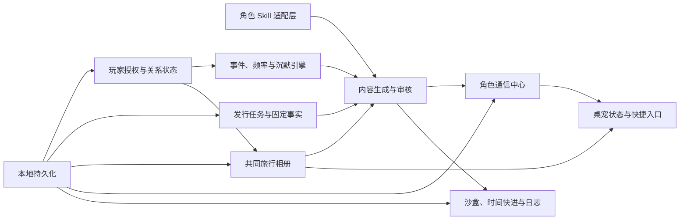

# ReHoYo「角色同行计划」桌宠端实施计划

> 计划版本：v1.0
>
> 对齐文档：`ReHoYo_角色同行计划_PRD_v1.0.md`
>
> 当前角色：三月七
>
> 执行原则：共同旅行相册与角色通信中心优先，所有生成内容可追溯、所有长期记忆可控制、所有主动联系可停止。

## 1. 目标

当前仓库已经验证了透明桌宠窗口、三月七基础互动、DeepSeek 对话和 CosyVoice 流式语音。本计划将其扩展为 ReHoYo「角色同行计划」玩家端 MVP，并补齐发行沙盒所需的本地能力。

MVP 完成后，应能在不接入真实游戏账号、真实玩家数据或外部发布渠道的前提下，完整演示：

1. 玩家了解产品并主动选择三月七；
2. 玩家设置内容、频率、勿扰、记忆和召回授权；
3. 一次选择写入共同旅行记忆；
4. 桌宠提供低打扰陪伴；
5. 共同相册展示并管理长期记忆；
6. 通信中心承载日常、旅行和版本消息；
7. 角色发行任务经过固定事实检查和人工审核；
8. 时间快进后，三月七在授权范围内引用共同记忆；
9. 玩家表达不感兴趣后，对应发行内容立即停止；
10. 全部过程能够查看日志并一键重置。

## 2. 范围边界

### 2.1 MVP 范围内

- 单角色三月七；
- 三个模拟玩家；
- 本地持久化；
- 本地发行沙盒；
- 共同旅行相册；
- 角色通信中心；
- 首次进入和授权设置；
- 关系、事件、频率、勿扰和沉默规则；
- 发行任务、固定事实、审核、暂停和停止；
- 时间快进、执行日志和重置 Demo；
- 透明桌宠窗口、托盘、吸附、点击穿透和位置记忆；
- DeepSeek 和 CosyVoice 作为可关闭的演示增强能力。

### 2.2 MVP 范围外

- 真实米游社、HoYoLAB 或游戏账号；
- 真实玩家行为、消费数据或未授权画像；
- 自动向外部平台发送内容；
- 多角色同时陪伴；
- 无边界自由聊天和无限长期记忆；
- 从网络自动抓取官方资产；
- 由模型自由决定版本事实；
- 将角色变成客服、心理咨询或效率助手；
- 真实商业指标回传。

### 2.3 已有能力的处理

- DeepSeek 自由聊天保留为实验入口，不作为 MVP 主闭环；
- CosyVoice 保留为可选语音增强，默认不影响文字和主流程；
- API Key 继续只在 Electron 主进程读取；
- 当前静态角色图继续作为明确标记的概念视觉；
- Live2D 和受限原始素材不进入仓库。

## 2.4 执行状态

| 阶段 | 状态 | 完成日期 | 说明 |
| --- | --- | --- | --- |
| 阶段 0：计划、基线与验收矩阵 | 已完成 | 2026-07-24 | 实施路线、风险清单、验收映射已建立 |
| 阶段 1：领域模型、Skill 与持久化 | 已完成 | 2026-07-24 | 统一契约、结构化 Skill Profile、本地模拟数据和恢复机制已建立 |
| 阶段 2：共同旅行相册 | 已完成 | 2026-07-24 | 查看、筛选、引用控制、删除、清空、导出和确认保存已实现 |
| 阶段 3：角色通信中心 | 已完成 | 2026-07-24 | 分类、未读、收藏、固定反馈、偏好与完整追溯已实现 |
| 阶段 4：首次进入、授权与关系设置 | 已完成 | 2026-07-24 | AI 披露、授权偏好、首次选择、暂停、退出和删除已实现 |
| 阶段 5：事件、频率、勿扰与沉默 | 已完成 | 2026-07-24 | 事件队列、联系策略、跨午夜勿扰、频率、重复抑制和七天安静期已实现 |
| 阶段 6：发行任务、固定事实与审核 | 已完成 | 2026-07-24 | 本地发行沙盒、锁定事实、双层审核、投递前策略检查和任务停止已实现 |
| 阶段 7：模拟玩家、时间快进与日志 | 已完成 | 2026-07-24 | 三类玩家、独立 Demo 时钟、排期执行、风险动作、日志和确定性重置已实现 |
| 阶段 8：桌宠系统能力补齐 | 已完成 | 2026-07-24 | 位置与尺寸持久化、吸附、托盘/右键菜单、安全穿透、多屏边界和七类状态已实现 |
| 阶段 9：安全、隐私、许可和运营风险 | 已完成 | 2026-07-24 | 内容安全、数据清单、完整导出、音色授权门禁、预算熔断、许可登记、发布审计与平台矩阵已实现 |
| 阶段 10：验收、文档与发布准备 | 未开始 | — | — |

## 3. 总体架构

### 3.1 分层原则

- **领域层**：只包含类型、规则、状态迁移和纯函数，可单元测试；
- **持久化层**：由 Electron 主进程负责文件读写、迁移、导出和重置；
- **IPC 层**：只暴露白名单操作，不向渲染进程暴露文件系统；
- **界面层**：桌宠、相册、通信中心、设置和沙盒页面；
- **模型层**：DeepSeek 只能在 Skill、固定事实、授权记忆和事件模板约束下生成；
- **语音层**：只朗读已经通过展示或审核的文本，不参与内容决策。

## 4. 分阶段实施

## 阶段 0：计划、基线与验收矩阵

### 交付物

- 本实施计划；
- PRD 验收项到功能和测试的映射；
- 风险登记表；
- 每阶段提交、测试和回滚边界。

### 完成标准

- 后续工作都能归入明确阶段；
- 每阶段存在可独立验证的交付物；
- 新增需求需要说明属于 P0、P1 或实验项。

## 阶段 1：统一领域模型、Skill 适配与本地持久化

### 交付物

- `CharacterSkillProfile`；
- `PlayerCompanionProfile`；
- `RelationshipState`；
- `MemoryRecord`；
- `RelationshipEvent`；
- `CharacterMessage`；
- `CharacterCampaignTask`；
- `ExecutionLogEntry`；
- 带 `schemaVersion` 的 `CompanionData`；
- 默认三月七 Skill Profile；
- 原子写入、数据校验、迁移、导出和重置接口；
- 纯函数和持久化单元测试。

### 关键约束

- 人格设定不得散落在 React 组件；
- 每条内容记录 `characterId`、`skillVersion`、模板和规则；
- Skill 缺少关键字段时不能进入 `approved`；
- 版本事实与角色提示词分离；
- 默认数据必须明确标记为模拟数据；
- 普通闲聊不自动写入长期记忆。

### 完成标准

- 应用重启后相册、消息、授权和日志仍存在；
- 旧数据损坏时安全回退，不覆盖原文件；
- 不保存模型或 TTS API Key 到业务数据文件；
- 所有领域规则可以在无 Electron UI 环境下测试。

## 阶段 2：共同旅行相册

### 交付物

- 相册入口和独立面板；
- 时间轴和类型筛选；
- 初次同行、选择、照片、明信片、里程碑、版本和回归卡片；
- 记忆详情；
- 开关“允许三月七未来引用”；
- 删除单条记忆；
- 清空全部记忆二次确认；
- 导出模拟记忆 JSON；
- 关闭长期记忆；
- 从“拍照”互动创建一条可控的模拟照片记忆。

### 完成标准

- 玩家可以查看全部长期记忆；
- 关闭引用后，内容生成选择器无法取得该记忆；
- 删除后相册、消息引用和可用记忆索引保持一致；
- 普通聊天不会自动出现在相册；
- 所有破坏性操作都有明确提示和确认。

## 阶段 3：角色通信中心

### 交付物

- 全部、日常、照片、明信片、关系、版本和收藏筛选；
- 消息列表和详情；
- 未读状态和桌宠角标；
- 固定选项回复；
- 喜欢、收藏、稍后再看、不感兴趣；
- 降低此类内容频率；
- 不再接收此类内容；
- 模拟版本入口；
- 事件、任务、记忆、固定事实、Skill 版本和审核状态追溯。

### 完成标准

- 聊天记录和通信消息为两类独立数据；
- 未审核消息不能出现在玩家收件箱；
- 不感兴趣会更新偏好并写执行日志；
- 版本行动按钮只能进入产品内模拟页面；
- 消息删除或归档不会破坏审核记录。

## 阶段 4：首次进入、授权与关系设置

### 交付物

- 概念体验、数据和隐私说明；
- 三月七选择页；
- 主动联系、内容类型、召回、个性化和记忆授权；
- 联系频率和勿扰时间；
- 第一次同行问题；
- 第一条共同记忆；
- 暂停、恢复、退出和删除关系数据；
- 同意版本记录；
- `new`、`familiar`、`companion`、`dormant` 关系阶段。

### 完成标准

- 未完成授权前不主动联系；
- 召回默认关闭并单独授权；
- 退出后不再产生主动消息；
- 产品 UI 明确披露 AI 和第三方服务，角色对话仍保持人设；
- 玩家能够随时撤销授权并删除数据。

## 阶段 5：事件、频率、勿扰与沉默

### 交付物

- PRD 定义的 `RelationshipTrigger`；
- 事件队列和状态迁移；
- 主动联系计数；
- 每周、版本周期和消息类型频率限制；
- 勿扰跨午夜计算；
- 连续忽略两次进入七天安静期；
- 内容重复检测；
- 暂停、退订、无有效事件时保持沉默；
- 抑制原因和日志。

### 完成标准

- 发行任务不能覆盖玩家授权、勿扰或频率限制；
- 相同输入得到可预测的允许或抑制结果；
- 每次不发送都能说明原因；
- 玩家主动交互不被错误计入主动联系。

## 阶段 6：发行任务、固定事实与审核

### 交付物

- 发行任务创建、编辑和状态流转；
- 版本、区域、玩家分群、阶段和时间计划；
- 固定事实管理；
- 日常、D-14、D0、D1～D14、D15～D42 和结束阶段；
- 模板直接输出、模板变量和有限生成；
- Skill、事实、剧透、敏感内容、营销强度、授权、频率和重复校验；
- 草稿、自动检查失败、待人工审核、批准、拒绝和过期；
- 任务暂停、恢复、停止和结束后回归日常。

### 完成标准

- 模型不得改写时间、奖励、活动名和安全链接；
- 只有 `approved` 内容能进入玩家沙盒；
- 每条内容能追溯使用的规则、事实和记忆；
- 暂停和停止立即生效；
- 任务结束后不再重复营销消息。

## 阶段 7：模拟玩家、时间快进、日志和重置

### 交付物

- 日本剧情玩家、中国活跃玩家、北美强度玩家；
- 第 1、7、14、42 天和自定义时间；
- 版本上线、忽略、回复、退订和风险触发；
- 执行日志筛选和详情；
- 一键载入默认案例；
- 一键重置 Demo；
- 三分钟演示引导。

### 完成标准

- 三分钟内能演示从长期陪伴到版本发行；
- 三类玩家按不同授权和偏好得到不同结果；
- 时间快进不依赖真实系统日期修改；
- 重置后恢复完全一致的默认数据。

## 阶段 8：桌宠系统能力补齐

### 交付物

- 窗口位置和尺寸记忆；
- 屏幕边缘吸附；
- 系统托盘和右键菜单；
- 暂停陪伴；
- 点击穿透切换及恢复入口；
- 勿扰状态；
- 待机、看照片、打瞌睡、左右观察、新消息、想起一件事和版本事件状态；
- 打开相册、通信中心、当前任务和关系设置的快捷操作；
- 新消息角标；
- 多显示器边界处理。

### 完成标准

- 暂停后不产生主动气泡；
- 点击穿透后始终存在可恢复方式；
- 吸附不会把窗口移出可见区域；
- 多显示器、缩放和全屏空间下行为可预测；
- 关闭窗口前安全完成数据写入。

### 已完成实现

- 独立 `window-state.json` 使用 `0600` 权限、临时文件和原子替换保存位置、尺寸、置顶和吸附偏好；
- 首次启动靠近主屏右下角，后续启动恢复上次位置；显示器增加、移除或工作区变化时重新约束到可见区域；
- 拖动期间保持连续，拖动结束后按当前显示器四边吸附；
- 系统托盘和桌宠右键菜单提供显示、恢复交互、吸附、置顶、暂停同行、相册、通信、发行、演示、同行设置和退出；
- 关闭按钮在托盘可用时安全隐藏窗口，托盘双击或菜单可以恢复；
- 只有成功创建托盘时才允许点击穿透，且每次重启都强制恢复可点击状态；
- 托盘暂停会同步渲染进程数据，联系策略继续阻断主动联系；
- 桌宠根据照片、相册、运行任务、未读通信、暂停/勿扰和时间轮换显示待机、拍照、打瞌睡、观察、新消息、记忆和版本状态；
- 430×660 可视检查无横向溢出，同行设置在固定窗口内使用独立纵向滚动；
- 窗口状态、多显示器选择、四边吸附、重启恢复和桌宠状态均有自动化测试。

## 阶段 9：安全、隐私、许可和运营风险

### 数据与隐私

- 数据最小化和用途说明；
- DeepSeek、DashScope 发送字段披露；
- 模拟数据水印；
- 数据查看、导出、撤销和删除；
- 日志脱敏；
- API Key 与业务数据隔离；
- 本地数据文件权限和损坏恢复。

### 内容与安全

- 提示词注入防护；
- 敏感、色情、骚扰、心理依赖和操纵性表达拦截；
- 未成年人友好边界；
- 不根据消费金额改变亲密表达；
- 角色不知道时自然承认不确定；
- 模型失败不绕过审核。

### 资产与许可

- 角色图、Skill、声音、字体和第三方库的来源清单；
- 素材许可范围、署名和再分发条件；
- 原始 Live2D、受限音频和临时 OSS 链接禁止进入仓库；
- 复刻音色的授权证据、使用范围和下架方式；
- 公开发布和商业演示前的人工合规复核。

### 成本与稳定性

- DeepSeek 和 TTS 使用量统计；
- 单次、单日和 Demo 配额；
- 请求超时、取消、重试和熔断；
- 离线回退；
- 崩溃恢复；
- Windows、macOS 和 Linux 测试矩阵；
- 签名、公证、自动更新和版本回滚规划。

### 完成标准

- 风险项有负责人、状态和发布门禁；
- 高风险许可未确认时，对应能力默认关闭；
- 第三方服务不可用时主流程仍可演示；
- 仓库扫描不包含密钥、受限素材或临时下载地址。

### 已完成实现

- `privacy-manifest.json` 记录五类本地文件、用途、保留、保护、玩家控制和两条第三方数据流；
- 同行设置支持导出完整业务数据，明确排除 API Key、音频缓存和自由聊天；
- 对话调用前拦截提示词提取、色情/未成年人、现实危机、专业结论和依赖/付费操纵请求；
- 模型输出后再次拦截内部信息、外链、排他依赖、离开内疚、付费换亲密、专业保证和色情内容；
- DeepSeek 每日限制 60 次/12 万字符，DashScope 每日限制 120 次/5 万字符；只记录计数，不记录正文；
- 第三方连续三次失败后熔断五分钟，成功后恢复；取消、Key 缺失和授权门禁不计为服务失败；
- CosyVoice 和自动朗读默认关闭，必须确认声音样本与复刻音色使用授权后才能启用或试听；
- March7th.Skill 来源固定到上游提交 `87c6d0db78fa9d9f2d3dd590337604e60f807d66`，并随仓库保留完整 MIT notice；
- 资产许可登记明确当前角色 PNG、声音权利证据、原 Live2D 排除和第三方依赖边界；
- `release-risk-register.json` 为许可、签名、平台验证、更新回滚、隐私与成本风险指定负责人、状态和门禁；
- 发布审计检查密钥、临时 OSS 参数、压缩包、Live2D、音频、Skill 固定版本和风险登记；
- 普通审计通过；严格发布审计因角色视觉权利证据、签名公证、跨平台原生验证和自动更新仍未完成而保持阻塞；
- macOS、Windows 与 Linux 平台矩阵不把“已配置构建目标”误写为“已验证支持”。

## 阶段 10：验收、文档与发布准备

### 交付物

- PRD 36 条验收标准逐项测试；
- 领域规则单元测试；
- Electron IPC 测试；
- 相册和通信中心组件测试；
- 三分钟演示端到端测试；
- 键盘、焦点、颜色对比和屏幕阅读器检查；
- 跨平台构建验证；
- README、隐私说明、演示说明和故障排查；
- 版本变更记录。

### 完成标准

- `npm run check` 通过；
- 生产构建通过；
- 默认案例可离线运行；
- 关键路径不存在未处理的 P0 问题；
- README 与实际行为一致；
- 每项 PRD 验收标准都有代码、测试或明确的未完成状态。

### 已完成实现

- `shared/prd-acceptance.json` 逐项记录 PRD 36 条标准、状态、说明和自动化证据，`npm run audit:acceptance` 校验编号、领域、文件与测试；
- 新增 preload/主进程 IPC 契约测试，确保渲染进程的 invoke、send 和事件订阅都有对应处理或发送端，且 bridge 不暴露文件系统、shell 或 Key 读取；
- 新增完整三分钟演示测试，确定性覆盖日本剧情玩家 Day 1、Day 14、Day 42、双层审核、投递、收藏/喜欢、不感兴趣、日常授权保留和完整重置；
- 新增记忆引用撤销回归测试，保证后续发行消息不会继续携带已撤销记忆；
- 所有浮层声明为模态对话框，背景控件进入 inert，Tab/Shift+Tab 在当前对话框内循环，`Esc` 可关闭，主要关闭按钮有初始焦点；
- 新增全局可见焦点样式和核心颜色 WCAG AA 对比度计算测试；
- 完成验收矩阵、三分钟演示、故障排查、发布检查表和版本变更记录；
- `package.json` 补充仓库、问题地址和作者元数据，安装包包含必要验收、隐私、安全、许可、平台与发布文档；
- PRD 原型验收 36/36 通过；视觉权利证据、macOS 签名公证、Windows/Linux 原生验证和自动更新回滚仍作为正式发布阻断保留。

## 5. 验收矩阵

| PRD 领域 | 主要阶段 | 最低自动化验证 |
| --- | --- | --- |
| Skill 接入 | 1、6 | Profile 完整性、缺失阻断、版本追溯 |
| 桌宠 | 5、8 | 拖动、吸附、暂停、勿扰、忽略降频 |
| 长期关系 | 2、4、5 | 记忆写入、引用关闭、删除、时间快进 |
| 通信中心 | 3、6 | 分类、回复、收藏、追溯、审核拦截 |
| 角色发行 | 6、7 | 阶段执行、固定事实、暂停、停止 |
| 安全 | 4、5、6、9 | 退订、授权、频率、事实、人设和模拟数据 |
| Demo | 7、10 | 第 1、14、42 天和完整重置 |

## 6. 风险登记

| 风险 | 级别 | 默认处理 |
| --- | --- | --- |
| 角色或视觉素材再分发权限不清 | 高 | 不打包、不上传，使用明确授权的占位资产 |
| 复刻声音授权或平台权限变化 | 高 | 功能可关闭，保留文字回退和下架开关 |
| 角色沉浸与 AI 披露冲突 | 高 | UI 诚实披露，角色层保持人设，安全授权优先 |
| 模型编造版本事实 | 高 | 固定事实只读注入，发布前自动和人工审核 |
| 未授权记忆被引用 | 高 | 查询层先过滤，生成层二次检查，发送前最终校验 |
| 主动联系造成打扰 | 高 | 授权、勿扰、频率、忽略降频和一键暂停 |
| 提示词注入绕过人设或安全 | 高 | 输入清理、系统规则隔离、输出校验和有限场景 |
| 本地数据损坏或迁移失败 | 中 | 原子写入、版本迁移、备份和安全回退 |
| 第三方 API 费用失控 | 中 | 配额、统计、取消、长度限制和自动关闭 |
| 多平台窗口行为不一致 | 中 | 平台矩阵和 Electron 端到端验证 |
| 自由聊天稀释长期关系定位 | 中 | 标记实验能力，不作为主动联系与长期记忆来源 |
| TTS 延迟或失败阻塞体验 | 中 | 文字优先、流式播放、独立控制和本地回退 |

## 7. 可能出现的工程问题

- 透明窗口与复杂面板共用固定尺寸会导致内容拥挤；
- 点击穿透与恢复入口设计不当会让窗口无法操作；
- 屏幕缩放和多显示器坐标可能导致窗口越界；
- 勿扰时间跨午夜时容易出现错误；
- 删除被消息引用的记忆会产生悬空引用；
- 时间快进和真实系统时间混用会让测试不可复现；
- React 乐观更新和主进程写入失败可能导致界面与磁盘不一致；
- 模型回复渐进显示和通信消息持久化可能保存半句话；
- TTS 自动播放与勿扰、暂停或消息授权可能冲突；
- Skill 更新后历史消息必须保留旧版本，不应被批量重写；
- 任务停止与正在进行的模型或 TTS 请求之间存在竞态；
- 重置 Demo 必须同时清理业务数据、内存状态和未完成事件；
- 打包后静态资源路径、导出目录和文件权限可能与开发环境不同；
- 相册图片增长会放大本地存储，需要缩略图、大小限制和清理策略；
- 日志既要可追溯，又不能记录 API Key、完整敏感输入或音频样本。

## 8. Git 与质量门禁

每个阶段按照以下顺序执行：

1. 更新计划状态；
2. 实现单一阶段或可独立验证的子阶段；
3. 增加或更新测试；
4. 运行 `npm run check`；
5. 涉及 Electron 主进程时运行打包验证；
6. 检查 Git diff、密钥、受限素材和临时链接；
7. 创建语义明确的提交；
8. 推送 `main`；
9. 在本计划中更新完成状态和遗留问题。

不得将未完成且无法安全关闭的 P0 功能伪装为完成。实验能力必须具有显式开关，并且不能绕过授权、审核或停止规则。
